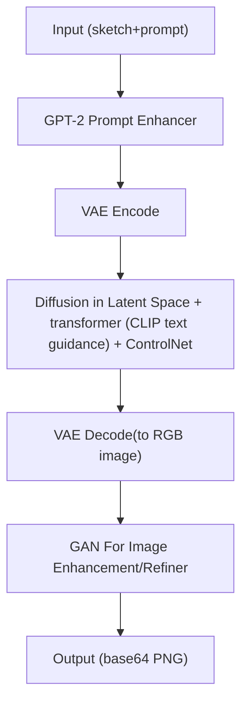

# PaintDiffusion – Full Implementation (VAE + Transformer + Diffusion + GAN)

This is a **reference implementation** of PaintDiffusion: an AI-assisted digital painting tool
that combines a VAE latent space, Transformer-based text conditioning, a latent diffusion core
(with optional ControlNet), and an GAN-based upscaler/refiner.

> Works out-of-the-box with Hugging Face `diffusers` (Stable Diffusion 1.5/XL) and optional ControlNet.
> FastAPI backend with endpoints for text-to-image, image-to-image, inpainting, and upscale.
> Minimal web client (HTML/Canvas/JS) for sketch mask + prompt + generate.
> GAN refiner included.

---

## 1) Setup

```bash
# Python 3.10+ recommended
python -m venv venv
source venv/bin/activate  # on Windows: venv\Scripts\activate

pip install -r requirements.txt
# If you want ControlNet edges:
# pip install controlnet-aux
```

> If you're on Windows PowerShell, use `$env:SD_MODEL="runwayml/stable-diffusion-v1-5"` etc.

---

## 2) Run the server

```bash
uvicorn server.app:app --host 0.0.0.0 --port 8000
```

Open the **client/index.html** in a browser (or serve it with any static server).
Point it to `http://localhost:8000` in the settings panel.

---

## 3) Endpoints (FastAPI)

- `POST /generate` – text-to-image or image-to-image (strength), optional **control** (sketch/edge) and **mask** for inpainting.
- `POST /upscale` – optional GAN/SR upscaler (no-op by default, returns input if not configured).
- `POST /encode_text` – cacheable text embeddings (not required for basic usage).
- `GET /health` – health check.

All image payloads are **base64-encoded PNG** strings.

---

## 4) Notes

- By default, this uses **latent diffusion (Stable Diffusion)** with a **VAE** (AutoencoderKL) and a **Transformer** text encoder (CLIP).
- **ControlNet** is supported if a model is provided via `CONTROLNET` env var.
- The **GAN refiner** is provided as a simple hook; integrate ESRGAN/Real-ESRGAN if needed.
- This is a **reference** stack oriented towards clarity and hackability, not a production-grade highly-optimized build.
- For GPU usage, ensure you have **CUDA** and install PyTorch accordingly from https://pytorch.org.

---

## 5) How it works (architecture + pipeline)

PaintDiffusion is a small client–server app built around Hugging Face diffusers.

- Client (`client/index.html`, `script.js`, `style.css`)
	- Minimal UI: prompt, negative prompt, width/height, steps, guidance, seed.
	- Optional inputs:
		- init image (img2img)
		- mask (inpainting)
		- sketch/control image (ControlNet; e.g., canny/scribble)
	- Encodes images/masks to base64 PNG and POSTs to the API.

- Server API (`server/app.py`)
	- FastAPI routes: `/generate`, `/upscale`, `/encode_text`, `/health`, plus info routes.
	- Optionally enhances the prompt with a small GPT‑2 helper.
	- Delegates actual image creation to the orchestrator in `server/ldm.py`.

- Orchestrator (`server/ldm.py`)
	- Loads Stable Diffusion (txt2img), Img2Img, optional ControlNet pipeline, and optional custom VAE.
	- Memory-aware execution for 4 GB GPUs: attention/vae slicing, CPU/sequential offload, and an OOM retry path.
	- Preprocesses sketch inputs (e.g., Canny edges) and wires controlnet_conditioning_scale.

- Optional GAN Refiner (`server/gan_refiner.py`)
	- Wraps GANModel for 4× upscaling when enabled and the weight file is present.
	- If disabled or missing weights, returns the diffusion output unchanged.

- Prompt helper (`server/text_encoder.py`)
	- Provides `/prompt-variations` and can enrich prompts before generation. CLIP still encodes the final text for diffusion.


## 6) End-to-end flow

1) User fills the form in the client, optionally draws/uploads a sketch or mask, then clicks Generate.
2) Client sends JSON to `/generate` with base64 PNGs for any images/masks and numeric params (size, steps, guidance, seed, etc.).
3) Server optionally enhances the prompt (GPT‑2), then chooses the right path:
	 - ControlNet path (if sketch provided + model available)
	 - Img2Img path (if init image provided)
	 - Inpainting (if mask provided)
	 - Otherwise pure txt2img
4) The chosen diffusers pipeline runs with low‑VRAM safeguards:
	 - dims forced to multiples of 8 and capped conservatively
	 - attention slicing + (if available) VAE slicing
	 - CPU/sequential offload to lower peak VRAM
	 - OOM retry once at smaller size/steps
5) The resulting PIL image is optionally upscaled 4× via GANModel (if enabled), then returned as base64 PNG.


## 7) Key endpoints (contracts)

- POST `/generate`
	- Input (JSON):
		- `prompt` (string), `negative_prompt` (optional)
		- `width`, `height` (multiples of 8), `num_inference_steps`, `guidance_scale`, `seed` (optional)
		- `init_image` (base64 PNG, optional; enables img2img), `strength` (for img2img)
		- `mask` (base64 PNG, optional; enables inpainting)
		- `sketch` (base64 PNG, optional; enables ControlNet)
		- `controlnet_method` (e.g., `canny`/`scribble`), `controlnet_conditioning_scale`
	- Output (JSON): `{ "image": "data:image/png;base64,..." }`

- POST `/upscale`
	- Input: `{ "image": "data:image/png;base64,...", "scale": 4 }`
	- Output: upscaled base64 PNG (no‑op if GAN refiner not configured)

- POST `/encode_text`
	- Input: `{ "text": "a prompt" }`
	- Output: serialized embeddings for advanced use/caching

- GET `/health` – simple status.


---

## 8) Architecture diagram



---

## 9) Conceptual pipeline: input → GPT → VAE → diffusion → GAN → output

This is the straight‑line view you asked for. GPT and GAN are optional, and the VAE both encodes (for img2img/inpainting) and decodes (always) around the latent diffusion core.

- Input
  - From the client: prompt (+ negative prompt), size/steps/guidance/seed, optional init image, mask, sketch.
- GPT (optional)
  - A small GPT‑2 helper enriches the prompt text for creativity/clarity (`server/text_encoder.py`).
  - Output: enhanced prompt string.
- VAE
  - Encode (only if init image provided): converts the init image to a latent tensor to start from.
  - Decode (always at the end): converts the final latent back to an RGB image.
- Diffusion (latent)
  - Stable Diffusion UNet runs in latent space for N steps using the (CLIP‑encoded) prompt as guidance.
  - Optional ControlNet injects structure from your sketch/edges.
- GAN (optional)
  - GANModel upscales/refines the decoded image (e.g., 4×) if enabled and weights are available.
- Output
  - Final image returned to the client as a base64‑encoded PNG.

---

## 10) Mathematical formulations

This section covers the core math behind each stage of the pipeline.

### VAE (Variational Autoencoder)

The VAE learns a latent representation $z$ of an image $x$.

- **Encoder**: $q_\phi(z|x)$ approximates the posterior; typically Gaussian: $q_\phi(z|x) = \mathcal{N}(z; \mu_\phi(x), \sigma_\phi^2(x))$
- **Decoder**: $p_\theta(x|z)$ reconstructs the image from latent: $p_\theta(x|z)$
- **Loss (ELBO)**:
  $$\mathcal{L}_{\text{VAE}} = \mathbb{E}_{q_\phi(z|x)}[\log p_\theta(x|z)] - D_{\text{KL}}(q_\phi(z|x) \| p(z))$$
  where $D_{\text{KL}}$ is the Kullback–Leibler divergence and $p(z) = \mathcal{N}(0, I)$ is the prior.

In practice, Stable Diffusion uses a pre-trained AutoencoderKL that compresses images to a smaller latent dimension (e.g., 512×512 → 64×64×4).

### Diffusion (Latent Diffusion / DDPM)

Diffusion models learn to reverse a noise process. Given latent $z_0$ (from VAE encode or random noise):

- **Forward process** (adds noise over $T$ steps):
  $$q(z_t | z_{t-1}) = \mathcal{N}(z_t; \sqrt{1-\beta_t} z_{t-1}, \beta_t I)$$
  where $\beta_t$ is the noise schedule.

- **Reverse process** (learned denoising):
  $$p_\theta(z_{t-1} | z_t, c) = \mathcal{N}(z_{t-1}; \mu_\theta(z_t, t, c), \Sigma_\theta(z_t, t))$$
  where $c$ is the text condition (CLIP embedding).

- **Training objective** (simplified):
  $$\mathcal{L}_{\text{diffusion}} = \mathbb{E}_{t, z_0, \epsilon} \left[ \| \epsilon - \epsilon_\theta(z_t, t, c) \|^2 \right]$$
  The UNet $\epsilon_\theta$ predicts the noise added at step $t$.

**Sampling** (DDIM or DDPM scheduler): starts from $z_T \sim \mathcal{N}(0,I)$ and iteratively denoises to $z_0$.

### ControlNet (Conditional Guidance)

ControlNet adds spatial conditioning (e.g., edges from Canny):

- **ControlNet block**: injects a processed control image $c_{\text{control}}$ into the UNet layers.
- **Modified forward**:
  $$z_{t-1} = \text{UNet}_\theta(z_t, t, c_{\text{text}}, c_{\text{control}}, \lambda)$$
  where $\lambda$ is `controlnet_conditioning_scale` (controls adherence to structure).

The control is typically encoded through additional convolutional layers and added to intermediate UNet features.

### GAN (Generative Adversarial Network) – Refiner

GANModel uses an adversarial approach for super-resolution:

- **Generator** $G$: upscales low-res image $I_{\text{LR}}$ to high-res $I_{\text{HR}}$: $\hat{I}_{\text{HR}} = G(I_{\text{LR}})$
- **Discriminator** $D$: distinguishes real HR images from generated ones.
- **Adversarial loss**:
  $$\mathcal{L}_{\text{adv}} = \mathbb{E}[\log D(I_{\text{HR}})] + \mathbb{E}[\log(1 - D(G(I_{\text{LR}})))]$$
- **Perceptual loss** (optional): measures feature similarity in a pre-trained VGG network.
- **Total Generator loss**:
  $$\mathcal{L}_G = \mathcal{L}_{\text{adv}} + \lambda_{\text{percep}} \mathcal{L}_{\text{percep}} + \lambda_{\text{pixel}} \|I_{\text{HR}} - \hat{I}_{\text{HR}}\|_1$$

In this pipeline, we use a pre-trained GANModel for 4× upscaling without further training.

### CLIP (Text Encoder)

CLIP embeds text prompts into a shared vision–language space:

- **Text embedding**: $c = \text{CLIP}_{\text{text}}(\text{prompt})$
- Used as conditioning $c$ in the diffusion UNet via cross-attention:
  $$\text{Attention}(Q, K, V) = \text{softmax}\left(\frac{QK^T}{\sqrt{d}}\right) V$$
  where $Q$ comes from image features and $K, V$ from text embeddings.


